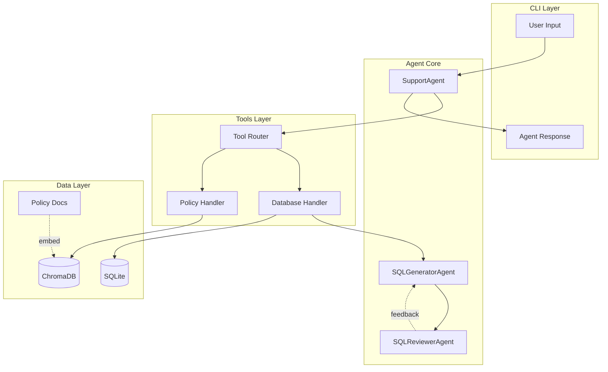
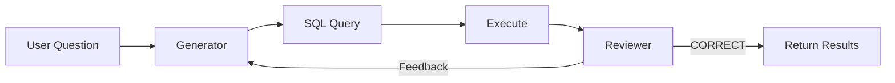

# Customer Support Agent
[](https://opensource.org/licenses/MIT)
[](https://www.python.org/downloads/)

A CLI-based customer support agent powered by OpenAI with SQL database and RAG tools.

## Features

- **Order Management**: Query customer orders, order status, and tracking information
- **Product Lookup**: Check product details, pricing, and stock levels
- **Policy Search**: RAG-powered search across company policies (returns, shipping, warranty)
- **Conversation History**: Maintains context across multiple exchanges
- **Multi-Agent SQL**: Uses generator and reviewer agents for accurate SQL queries
- **Robustness**: Retry logic, conversation truncation, and tool timeouts
- **CI/CD**: GitHub Actions with Python 3.11/3.12 matrix testing

## Architecture

This project uses a **Reflection Agent** pattern with **ReAct prompting** for improved accuracy and reasoning.



### Reflection Agent Pattern

The SQL query generation uses a **reflection loop** with two specialized agents:



1. **Generator** creates an initial SQL query from natural language
2. **Reviewer** evaluates the query and results against the original question
3. If incorrect, **feedback** is sent back to the Generator for correction
4. Loop continues until the Reviewer approves or max attempts reached

### ReAct Prompting

All agents use **ReAct (Reasoning + Acting)** style prompts optimized for reasoning models:

```
Think step by step:
1. Understand what is being asked
2. Identify relevant information
3. Determine the appropriate action
4. Execute and verify the result
```

This approach leverages the model's chain-of-thought capabilities for more accurate and explainable responses.

### Parallel Tool Execution

When the LLM returns multiple tool calls in a single response, they are executed **concurrently** using `asyncio.gather()` for better performance:

```python
# Multiple tools run in parallel
results = await asyncio.gather(*[
    self._execute_tool(item.name, item.arguments)
    for item in output if item.type == "function_call"
])
```

### Component Overview

| Component | Description |
|-----------|-------------|
| **SupportAgent** | Main orchestrator with ReAct prompting and function calling |
| **SQLGeneratorAgent** | Generates SQL queries with step-by-step reasoning |
| **SQLReviewerAgent** | Reviews queries using LLM-as-judge pattern |
| **Tool Router** | Dictionary-based routing to tool handlers |
| **PolicyStore** | ChromaDB vector store with semantic search |

## Project Structure

```
customer_support_agent/
├── main.py                  # CLI entry point
├── pyproject.toml           # Dependencies and config
│
├── agent/                   # Agent implementations
│   ├── core.py              # Main SupportAgent with OpenAI
│   ├── sql_generator.py     # SQL generation agent
│   └── sql_reviewer.py      # SQL review agent
│
├── tools/                   # Tool definitions and handlers
│   ├── definitions.py       # OpenAI function schemas
│   ├── router.py            # Tool call routing
│   └── handlers/
│       ├── database.py      # SQL query handler
│       └── policies.py      # RAG search handler
│
├── database/                # SQLite layer
│   ├── connection.py        # Connection manager
│   ├── models.py            # Schema definitions
│   └── seed.py              # Sample data
│
├── rag/                     # RAG implementation
│   ├── embeddings.py        # OpenAI embeddings
│   ├── loader.py            # Document chunking
│   └── vectorstore.py       # ChromaDB operations
│
├── utils/                   # CLI utilities
│   ├── cli.py               # Console and display helpers
│   └── initialization.py    # System startup
│
├── policies/                # Policy documents
│   ├── returns.md
│   ├── shipping.md
│   └── warranty.md
│
├── tests/                   # Test suite
│   ├── conftest.py          # Shared fixtures
│   ├── test_agent_*.py      # Agent tests
│   ├── test_database.py     # Database tests
│   ├── test_rag_*.py        # RAG tests
│   └── test_tools_*.py      # Tool tests
│
└── data/                    # Runtime data (gitignored)
    ├── support.db           # SQLite database
    └── chroma/              # Vector store
```

## Setup

### Prerequisites

- Python 3.11+
- [uv](https://docs.astral.sh/uv/) package manager
- OpenAI API key

### Installation

1. **Clone the repository**:
   ```bash
   git clone <repo-url>
   cd customer_support_agent
   ```

2. **Install dependencies**:
   ```bash
   uv sync
   ```

3. **Configure environment**:
   ```bash
   # Create .env file with your API key
   echo "OPENAI_API_KEY=sk-your-key-here" > .env
   ```

4. **Run the agent**:
   ```bash
   uv run main.py
   ```

## Usage

```
╭──────────────────── Welcome ────────────────────╮
│         Customer Support Agent                  │
│                                                 │
│ Ask me about orders, products, stock levels,    │
│ or company policies.                            │
│                                                 │
│ Commands:                                       │
│   quit or exit - Exit the agent                 │
│   clear - Clear conversation history            │
│   help - Show this message                      │
╰─────────────────────────────────────────────────╯

You: What's the status of order 2?
Agent: Order #2 is currently **shipped** and on its way...

You: What's your return policy?
Agent: Our return policy allows returns within 30 days...
```

## Configuration

| Environment Variable | Description | Default |
|---------------------|-------------|---------|
| `OPENAI_API_KEY` | Your OpenAI API key | Required |
| `OPENAI_MODEL` | Model to use | `gpt-5-mini` |
| `DATABASE_PATH` | SQLite database path | `data/support.db` |
| `CHROMA_PATH` | ChromaDB storage path | `data/chroma` |

## Development

### Running Tests

```bash
uv run pytest
```

### Test Coverage

```bash
uv run pytest --cov=. --cov-report=html
```

### Adding a New Tool

1. Add the handler function in `tools/handlers/`
2. Add the OpenAI function schema in `tools/definitions.py`
3. Register the handler in `tools/router.py`

### Robustness Features

The agent includes several reliability improvements:

| Feature | Description |
|---------|-------------|
| **Retry Logic** | 3 attempts with exponential backoff for transient API failures |
| **Conversation Truncation** | Keeps last 40 items (~20 turns) to prevent token overflow |
| **Tool Timeout** | 30-second timeout prevents hanging on slow tool execution |

## Sample Data

The agent comes pre-seeded with:
- 5 sample customers
- 8 products (electronics and accessories)
- 6 orders with various statuses (pending, processing, shipped, delivered, cancelled)

## License

MIT
